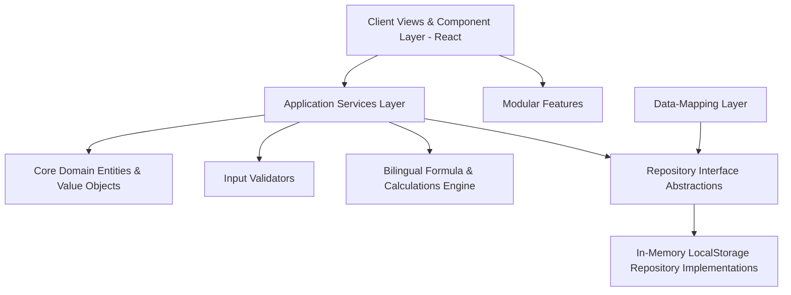

# ROWAD Enterprise Platform

[](#)
[](#)
[](#)
[](#)
[](#)

A modular, multi-tenant corporate Construction Operations Platform designed to manage mega-infrastructure pre-award proposals and post-award site execution transactions. By establishing absolute architectural segregation between client presentation views and standard domain business logic, the platform ensures total computational accuracy and complete compliance with corporate parameters.

* **Mission**: Eliminate fragmented sheets and manual spreadsheet calculations across engineering groups, replacing them with a singular, double-verified, bilingual digital ledger.
* **Vision**: Deliver a fully scalable, real-time "digital twin" of estimation, commercial tracking, scheduling offsets, and regulatory compliance on high-complexity mega-projects.
* **Main Capabilities**:
  * **Bilingual Execution**: Fluent real-time English and Arabic language translation toggle across all metrics and workflows.
  * **Algorithmic Estimation**: Exact mathematical formula checks for tender estimation thresholds and bidding guarantees.
  * **Automated Schedule Triggers**: Programmatic timeline offsets for pre-award proposal reviews and municipal permits.
  * **Double-Layered EDMS**: Complete document revision controls enforcing a strict "Makers & Checkers" verification.
  * **Computed Executive Reporting**: Dynamically compiled read-only performance digests (SPR) aggregating commercial site indicators without database CRUD overhead.

---

## Product Overview

ROWAD acts as a centralized operations hub for mid-to-large-scale general contractors. Rather than scattering construction management across disparate email threads and offline calculators, the platform aligns multi-disciplinary engineers into standard operational pipelines.

### Current Implemented Modules
1. **Executive Dashboard**: Unified cross-project performance visualizer tracking combined active contract sizes, bidding margins, risk levels, and operational health scores.
2. **Pre-Award (Tenders)**: A comprehensive five-step creation wizard managing upcoming project bids, pricing estimations, performance schedules, and bonding requirements.
3. **Project Controls (Execution)**: A real-time commercial ledger tracking Interim Payment Certificates (IPCs), Scope Variation Orders (VOs), Contractual Claims, and municipal permits (NOCs).
4. **Operations Center (Calendar)**: A highly interactive visual scheduling environment graphing critical milestones, technical proposal reviews, and field validation sessions.
5. **Document Control (EDMS)**: An engineering document management hub featuring transmittals, discipline-based filters, revision logs, and double-approval workflows.

### Planned Modules
* **Resource Allocator**: Machine-learning-assisted equipment scheduling and labor allocation curves based on active site progress.
* **Procurement & Material Ledger**: Granular supply-chain material tracking from technical submittal, mill inspections, to physical site delivery.

---

## Platform Architecture

The platform is designed around strict **Domain-Driven Design (DDD)** and **Clean Architecture** patterns, preserving decoupled business boundaries to enable seamless backend migrations.

> 📝 **Release Notice**: The platform architecture is officially certified as of the **[Enterprise Foundation Baseline v1.0](/docs/ai/ARCHITECTURE_BASELINE_v1.0.md)** release. All systems are verified to compile with 0.0% circular dependencies and 100% clean write flows.



### Architectural Pillars
* **Feature-Based Architecture**: Subsystems (Pre-Award, Controls, Documents) are encapsulated into explicit modules, avoiding global cross-import leaks.
* **Clean Architecture Boundary**: React client components act as pure stateless presentation structures, delegating scheduling offsets and arithmetic calculations to service layers.
* **Domain-Driven Design**: Explicit aggregates, value objects, and domain models govern state transitions instead of letting raw database types pollute the user interface.
* **SOLID Principles**: Single Responsibility classes (e.g., validators, mappers, calculators) prevent monolithic helper files and guarantee frictionless testing.

---

## Modules

<details>
<summary><b>1. Executive Dashboard (Analytics)</b></summary>
<p>
Consolidates critical commercial metrics across active tenders and site projects. Computes project health ratios, active proposal weights, and tracks regulatory margins. Utilizes performant, responsive SVG visualizers for high-level PMO monitoring.
</p>
</details>

<details>
<summary><b>2. Pre-Award Proposals (Tenders)</b></summary>
<p>
Guides estimators through bid study phases. Enforces standard estimation bounds, including mandatory bidding guarantees calculated at exactly 2.0% of estimated value, and calculates meeting timeline calendars using parameterized administrative offsets.
</p>
</details>

<details>
<summary><b>3. Project Controls (Site Execution)</b></summary>
<p>
Isolates ongoing transaction records into distinct ledgers (IPCs, Claims, Variation Orders, and NOCs). Highlights:
<ul>
  <li><b>Interim Payments (IPCs):</b> Standardizes progressive billing certifications.</li>
  <li><b>Claims Management:</b> Logs contractual dispute values and tracks active resolutions.</li>
  <li><b>Variation Orders (VOs):</b> Manages scope adjustments and client authorizations.</li>
  <li><b>No Objection Certificates (NOCs):</b> Tracks crucial civil permits.</li>
  <li><b>Single Paper Reports (SPR):</b> A dedicated, read-only reporting suite that dynamically compiles executive digests on-the-fly directly from transactional data, preventing database duplication.</li>
</ul>
</p>
</details>

<details>
<summary><b>4. Operations Center (Scheduling)</b></summary>
<p>
Interactive schedule planner tracking critical milestones. Calculates calendar distributions and warns of approaching review bottlenecks. Implements customized search parameters and filtering toggles.
</p>
</details>

<details>
<summary><b>5. Document Control (EDMS)</b></summary>
<p>
Manages engineering drawings, technical submittals, and corporate transmittals. Implements file revision logs, multi-discipline filters (Civil, Mechanical, Electrical, Architectural, Piping), and double-approval workflows (Maker-Checker system).
</p>
</details>

<details>
<summary><b>6. Administration (System Settings)</b></summary>
<p>
Allows users to toggle global parameters, adjust date offset criteria for upcoming pre-award schedules, choose language settings, and configure tenant controls.
</p>
</details>

---

## Technology Stack

* **Frontend**: React 19, TypeScript, Vite (Next-generation lightning-fast bundler)
* **Backend (Planned)**: Node.js Express / Python Fast-API microservices
* **Database (Planned)**: PostgreSQL (Relational transactional databases) / Cloud SQL
* **Authentication**: Firebase Auth (with multi-tenant roles verification)
* **State Management**: Domain Services Orchestration with local persistence adapters utilizing standard client-side storage (`localStorage`)
* **UI Framework**: Tailwind CSS v4 (Modern, utility-first styling with native variable support)
* **Animation**: Motion (Fluid, hardware-accelerated animations and micro-transitions)
* **Charts**: Recharts (Responsive, SVG-native analytics visualizers)
* **File Storage**: Planned Google Cloud Storage integration for official PDF/CAD drawings

---

## Folder Structure

```text
/
├── docs/                      # Centralized Documentation (The Platform Brain)
│   ├── adr/                   # Architecture Decision Records
│   ├── ai/                    # Living master blueprints, AI handoffs, and indexes
│   ├── business-rules/        # Official corporate formulas and calculation matrices
│   ├── domain/                # Decoupled domain business specifications (IPCs, Tenders)
│   └── ui-blueprint/          # Wireframe blueprints and modular layouts
├── src/                       # Main Code Workspace
│   ├── assets/                # Corporate static media assets
│   ├── business-rules/        # Evaluator algorithms (e.g. date offsetting, bid ratios)
│   ├── components/            # Atomic UI components (Buttons, Modals, Language Toggles)
│   ├── constants/             # Centralized constant metrics & bilingual copy keys
│   ├── domain/                # Static TypeScript Domain entities and models
│   ├── enums/                 # Domain enumeration properties (Disciplines, Statuses)
│   ├── features/              # Cohesive cross-component feature blocks
│   ├── mappers/               # Data-conversion adapters for service-to-view alignment
│   ├── repositories/          # Interface abstractions & LocalStorage persistent implementations
│   ├── services/              # Transactional orchestration algorithms
│   ├── validators/            # Formal data input validators
│   ├── views/                 # Root View layers (Dashboard, Pre-Award, Controls, EDMS)
│   ├── App.tsx                # Application shell layout and routing entrypoint
│   └── main.tsx               # Client bootstrapping
├── package.json               # Package declarations and script manifests
└── vite.config.ts             # Vite server configurations
```

---

## Documentation

To avoid information duplication, core logic, architecture schemas, and specifications are maintained inside the `/docs` folder. Developers **must** read these files before writing code:

| Document | Purpose |
| :--- | :--- |
| **[PROJECT_BOOK.md](./docs/ai/PROJECT_BOOK.md)** | The comprehensive, living master blueprint of the entire platform. Contains functional requirements, schema mappings, integration points, and security targets. |
| **[AI_HANDOFF.md](./docs/ai/AI_HANDOFF.md)** | Step-by-step developer progression logs, active task context, and current structural changes. |
| **[ARCHITECTURE_MAP.md](./docs/ai/ARCHITECTURE_MAP.md)** | Directory index, import constraints, flow boundaries, and package policies. |
| **[BUSINESS_RULES_INDEX.md](./docs/ai/BUSINESS_RULES_INDEX.md)** | Standard corporate calculations index, including the **2.0% Bidding Bond Formula** and **Date Offsetting rules**. |
| **[Domain Specifications](./docs/domain/)** | Granular data constraints for individual entities (e.g., [SinglePaperReport.md](./docs/domain/SinglePaperReport.md), [Tender.md](./docs/domain/Tender.md)). |
| **[UI Blueprints](./docs/ui-blueprint/)** | High-fidelity layouts, view flow transitions, and interactive criteria for each page. |

---

## Getting Started

### Prerequisites
* **Node.js** (v18.0 or higher recommended)
* **npm** (v9.0 or higher)

### Installation
1. Clone the repository to your local workspace:
   ```bash
   git clone https://github.com/your-org/rowad-enterprise-platform.git
   cd rowad-enterprise-platform
   ```
2. Install all development and production dependencies:
   ```bash
   npm install
   ```

### Project Scripts
Execute the following commands in the root directory:

* **Run Locally (Dev)**: Launches the local development server with Vite on port `3000`:
  ```bash
  npm run dev
  ```
* **Build Project**: Compiles static production bundle optimized for high-performance deployment:
  ```bash
  npm run build
  ```
* **Lint Code**: Validates TypeScript typing constraints and ensures 100% compile safety:
  ```bash
  npm run lint
  ```
* **Clean Artifacts**: Removes temporary builds and generated outputs:
  ```bash
  npm run clean
  ```

---

## Development Guidelines

### Creating a New Feature
1. **Define the Domain Spec**: Draft or reference the target domain model under `src/domain/` and document constraints in `docs/domain/`.
2. **Implement Business Logic**: Write isolated, testable validation checks inside `src/validators/` and calculation logic inside `src/business-rules/`.
3. **Draft the Service & Repository**: Add state coordination to `src/services/` and data adapters to `src/repositories/`.
4. **Build the Presenter Components**: Write clean Tailwind components inside `src/components/` or `src/views/`. Ensure all labels use localized dictionaries via `src/constants/languages.ts`.
5. **Run Linting**: Always verify compilation safety using `npm run lint` before committing.

### Architectural Rules
* **No Inline Logic**: Do not perform business-critical calculations or date arithmetic directly inside JSX. Delegate all calculations to domain services.
* **Pure Data Mapping**: Always map repository data models using dedicated converters in `src/mappers/` before delivering payloads to views.
* **Document Everything**: If a calculation formula or schema changes, update `docs/ai/PROJECT_BOOK.md` and the appropriate Domain Specification file immediately.

### Branch Organization
* `main` / `production`: Stable, locked, release-ready builds.
* `develop`: Integration branch for completed features.
* `feature/pmo-[module-name]`: Individual active development branches.

---

## Current Status

### Implemented Features
* **Bilingual Framework**: Complete real-time English and Arabic conversion across all active visual sheets.
* **Modular Pre-Award Estimator**: Full five-step wizard with real-time bidding bond (2%) and schedule calculations.
* **Project Controls Engine**: Real-time segregated transactional registers.
* **Single Paper Report Generator**: Fully operational, read-only dynamic compiler. It aggregates site data on-the-fly and generates print-ready sheets. No SQL database table overhead.
* **EDMS discipline-based filter system**: Maker-Checker transmittals working flawlessly.

### Known Technical Debt
* **Direct LocalStorage Adapters**: Data reads and writes rely on local memory wrappers. Requires transition to asynchronous database APIs.
* **Client-side PDF Exporter**: Printing uses native browser interfaces; requires server-side PDF compilation support for executive exports.

---

## Roadmap

```text
  ┌─────────────────────────────────┐
  │  v1.0.0 - Current Base Release   │ ──► Bilingual UI, Local storage, Pre-Award Wizard, 
  └─────────────────────────────────┘     Controls Ledger (IPC/Claim), and Dynamic SPR Reports.
                   │
                   ▼
  ┌─────────────────────────────────┐
  │  v2.0.0 - Cloud Integration      │ ──► PostgreSQL Databases, Firebase Auth, Real-time 
  └─────────────────────────────────┘     REST APIs, and Server-Side Document Uploads.
                   │
                   ▼
  ┌─────────────────────────────────┐
  │  v3.0.0 - AI Analytics SaaS     │ ──► Gemini OCR Document Analyzer, Automatic Claims
  └─────────────────────────────────┘     Forecasting, and SAP ERP Integration Adapters.
```

---

## Contributing

1. **Documentation-First Development**: We do not write code without writing the corresponding specification first. Create or update design blueprints in `/docs` prior to submitting code PRs.
2. **Code Decoupling**: React files should contain zero math formulas, date arithmetic, or regulatory assertions. Business logic belongs in dedicated services.
3. **Pull Request Quality**: Every PR must compile with zero errors under `npm run lint`.

---

## License

This repository is **Proprietary & Enterprise Confidential**. Unauthorized distribution, copying, or modification of these files is strictly prohibited under corporate policies.

© 2026 ROWAD Industrial & General Contracting Group. All rights reserved.
