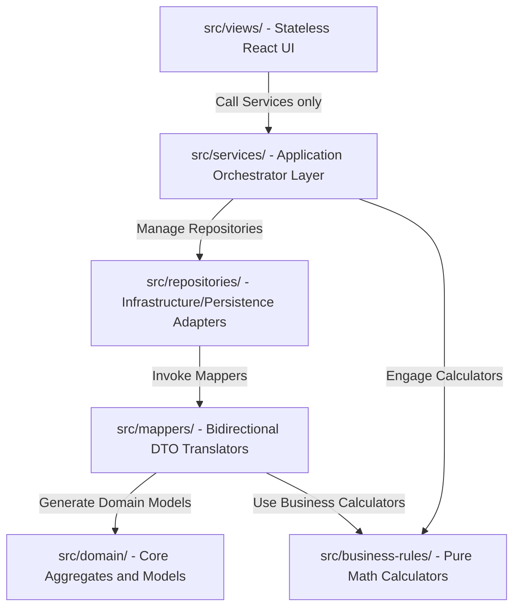
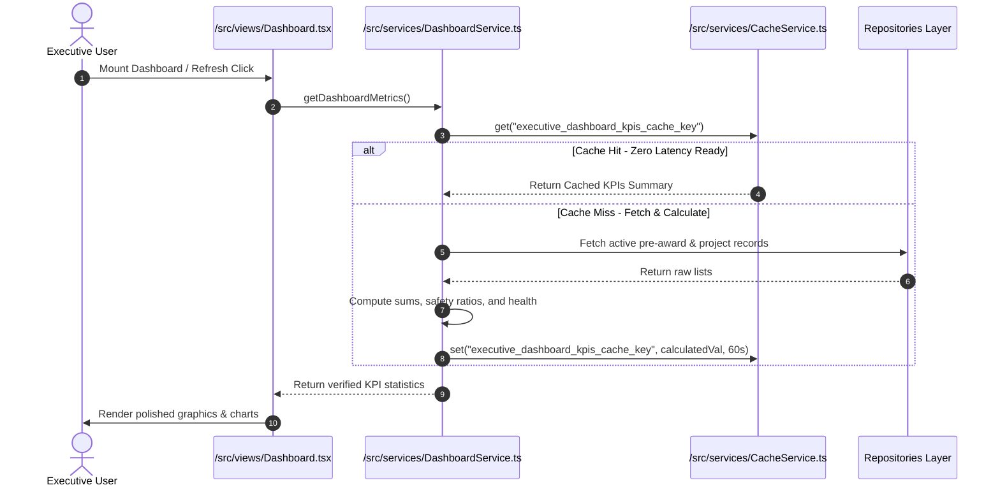
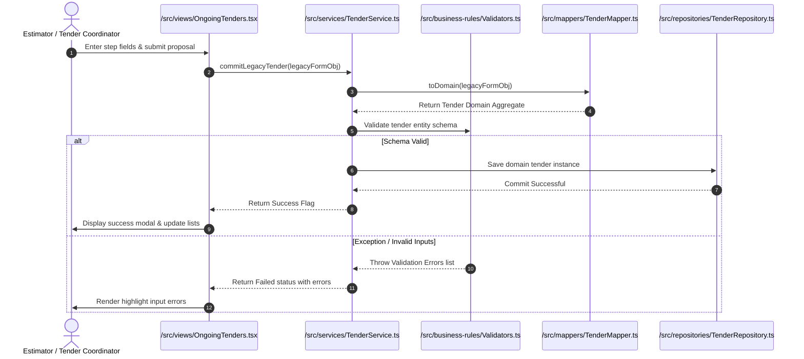

# ROWAD Enterprise - Core Architecture Map

This document visually maps the system architecture, directory structures, layer boundaries, and dynamic transaction flows.

---

## 1. Directory Dependencies Map

---

## 2. Dynamic Sequence: Dashboard KPI Refresh

---

## 3. Dynamic Sequence: Proposal Wizard Submit

---

## 4. Layer Isolation Guardrails

* **The UI Boundary**: React components are entirely isolated from low-level storage frameworks (SQL/REST, localStorage, or state machines).
* **The Business Boundary**: All core models live inside pure TypeScript structures. No framework dependencies (React, state managers, etc.) are allowed here.
