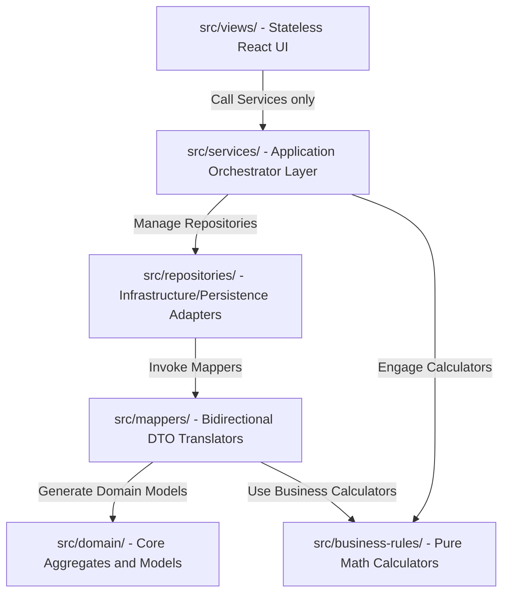
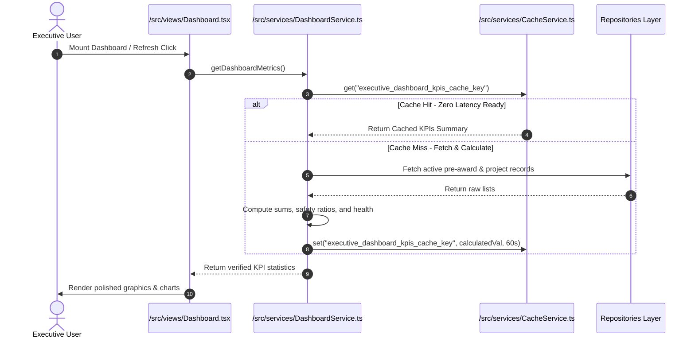
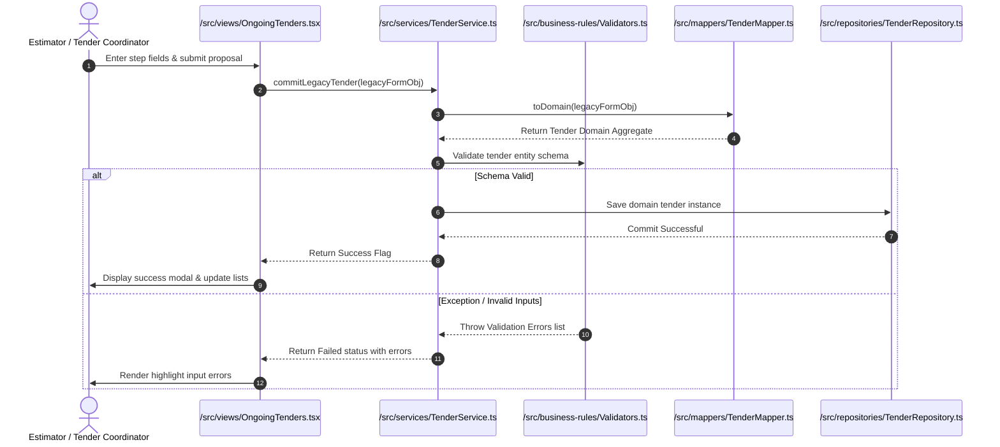

# ROWAD Enterprise - Core Architecture & Diagrams Map

This visual companion maps layers, directory boundaries, and sequence operations. 

For the complete service lists, repository maps, database roadmaps, and technical specifications, see the [Living Product Specification (PROJECT_BOOK.md)](./PROJECT_BOOK.md).

---

## 1. Directory Dependencies Map

The dependency flow between project directions is strictly unidirectional, preventing circular reference warnings:

For domain aggregates and model definitions, refer to [Data Ownership Matrix (PROJECT_BOOK.md#6-data-ownership--schema-mapping-matrix)](./PROJECT_BOOK.md#6-data-ownership--schema-mapping-matrix).

---

## 2. Dynamic Sequence: Dashboard KPI Refresh

This model charts the cached real-time performance aggregation managed by the application services:

For analytical formulas and caching specifications, refer to [Functional Requirements by Module (PROJECT_BOOK.md#31-module-a-executive-analytics-dashboard-dashboard)](./PROJECT_BOOK.md#31-module-a-executive-analytics-dashboard-dashboard).

---

## 3. Dynamic Sequence: Proposal Wizard Submit

This diagram maps the transaction verification pipeline when committing new pre-award estimations:

For validator functions and step configurations, see the [Pre-Award Proposals Module Specs in PROJECT_BOOK.md](./PROJECT_BOOK.md#32-module-b-pre-award-proposals-tenders).

---

## 4. Layer Isolation Guardrails

* **Stateless Visuals**: React code remains isolated from storage engines or calculators.
* **Pure Domain Core**: Models under `src/domain` remain fully isolated from external framework dependencies (React, state managers, persistence adapters).

For detailed coding standards and structure guidelines, refer to [Coding Standards (PROJECT_BOOK.md#18-coding-standards)](./PROJECT_BOOK.md#18-coding-standards).
