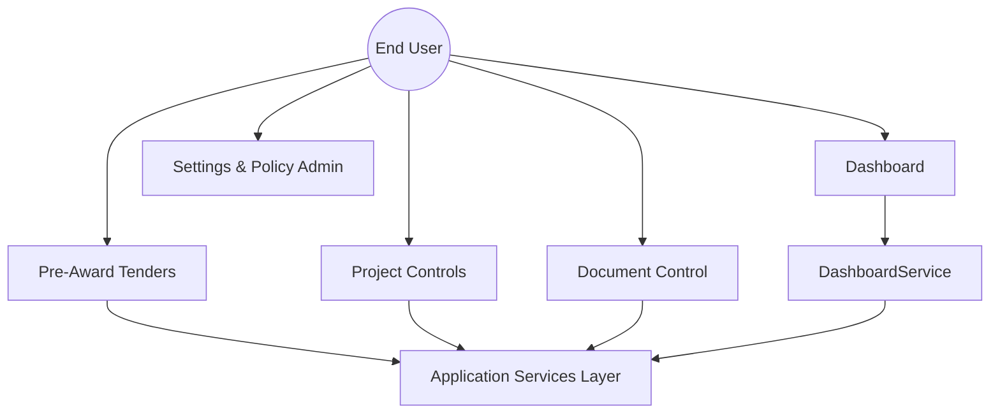
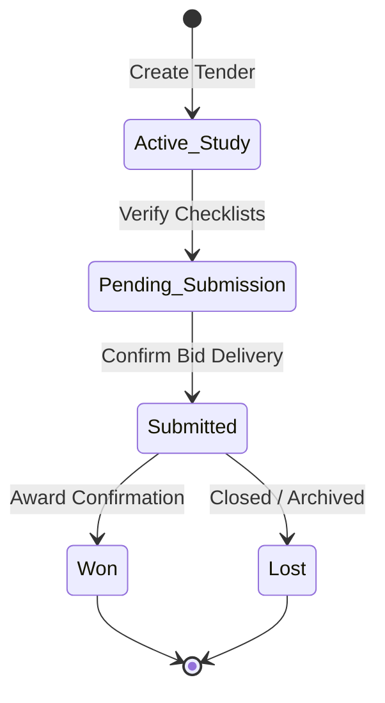
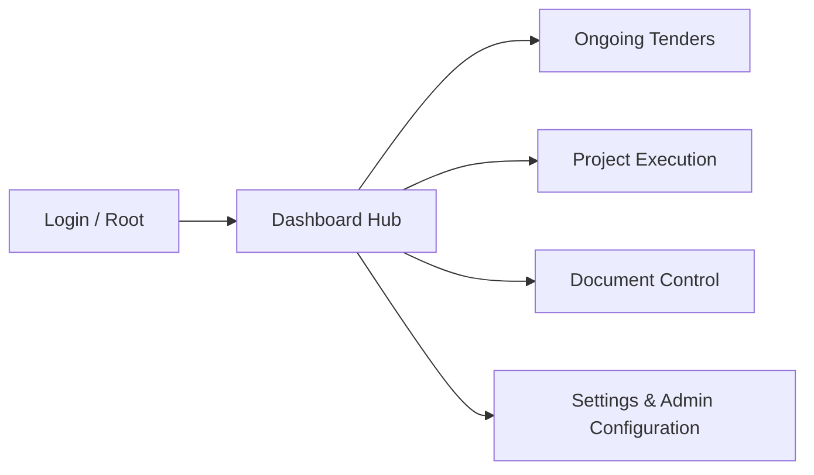

# ROWAD Enterprise Platform - Project Reference Book

Welcome to the official, complete technical brain of the **ROWAD Enterprise Platform**. This document is designed as the permanent source of truth for software architects, QA engineers, product managers, and downstream AI coders.

---

## Table of Contents

1. [#1-executive-summary](#1-executive-summary)
2. [#2-product-vision](#2-product-vision)
3. [#3-business-goals](#3-business-goals)
4. [#4-platform-overview](#4-platform-overview)
5. [#5-architecture-overview](#5-architecture-overview)
6. [#6-folder-structure](#6-folder-structure)
7. [#7-technology-stack](#7-technology-stack)
8. [#8-domain-model](#8-domain-model)
9. [#9-business-rules](#9-business-rules)
10. [#10-workflow-state-machines](#10-workflow-state-machines)
11. [#11-ui-blueprint](#11-ui-blueprint)
12. [#12-design-system](#12-design-system)
13. [#13-navigation-flow](#13-navigation-flow)
14. [#14-services](#14-services)
15. [#15-repositories](#15-repositories)
16. [#16-business-calculators](#16-business-calculators)
17. [#17-validators](#17-validators)
18. [#18-reporting-strategy](#18-reporting-strategy)
19. [#19-security-model](#19-security-model)
20. [#20-permissions](#20-permissions)
21. [#21-notifications](#21-notifications)
22. [#22-import-engine](#22-import-engine)
23. [#23-search](#23-search)
24. [#24-dashboard-logic](#24-dashboard-logic)
25. [#25-project-controls](#25-project-controls)
26. [#26-document-control](#26-document-control)
27. [#27-api-roadmap](#27-api-roadmap)
28. [#28-database-roadmap](#28-database-roadmap)
29. [#29-coding-standards](#29-coding-standards)
30. [#30-git-workflow](#30-git-workflow)
31. [#31-testing-strategy](#31-testing-strategy)
32. [#32-adr-index](#32-adr-index)
33. [#33-known-decisions](#33-known-decisions)
34. [#34-things-that-must-never-change](#34-things-that-must-never-change)
35. [#35-ai-onboarding](#35-ai-onboarding)
36. [#36-current-project-status](#36-current-project-status)
37. [#37-roadmap](#37-roadmap)
38. [#38-changelog](#38-changelog)

---

## #1 Executive Summary

The **ROWAD Enterprise Platform** is a custom multi-tenant ERP system built to manage and streamline mega-infrastructure tender calculations and site submittal engineering operations.

In complex infrastructure projects, traditional practices result in fragmented spreadsheets, missed regulatory milestones, and visual disconnection from live data. ROWAD resolves these problems by providing:
- Monitored timeline calculations in real time.
- Standardized financial calculation frameworks.
- Consolidated digital ledger representing real-time construction site submittals.

Target users include Estimators, PMO Directors, Contracts Engineers, Document Controllers, and Executive Boards within large infrastructure construction sectors.

---

## #2 Product Vision

ROWAD aims to provide an end-to-end digital twin of infrastructure pre-award and post-award project controls. 

The architecture is built upon absolute decoupling:
* Defer UI elements to stateless presentation trees.
* Fully lock business policy calculations within immutable, pure-typescript calculators and domain entities.
* Support future transition from browser-only databases to resilient PostgreSQL schemas with Zero-Visual-Regression.

---

## #3 Business Goals

Success metrics for ROWAD deployments are calculated across:
1. **0% Timeline Slip**: Clear warning paths before critical dates arrive.
2. **Standardized Calculations**: Universal formula resolution for tenders, bid bonds, and margins.
3. **Traceability**: Seamless auditing on all operational changes.

---

## #4 Platform Overview



---

## #5 Architecture Overview

The system strictly adheres to DDD (Domain-Driven Design) and Clean Architecture clean flows:

```
┌────────────────────────────────────────────────────────┐
│                      PRESENTER                         │
│       React View Components / Tailwind Templates       │
└───────────────────────────┬────────────────────────────┘
                            │ (Calls through Service)
                            ▼
┌────────────────────────────────────────────────────────┐
│                    APPLICATION SERVICES                │
│       Service Orchestrations (e.g., TenderService)     │
└───────────────────────────┬────────────────────────────┘
                            │ (Resolves Entities via DB)
                            ▼
┌────────────────────────────────────────────────────────┐
│                   INFRASTRUCTURE LAYER                 │
│       Repositories, LocalStorage SQL Emulators, Mappers│
└───────────────────────────┬────────────────────────────┘
                            │ (Maps to/from Pure Objects)
                            ▼
┌────────────────────────────────────────────────────────┐
│                        DOMAIN ENGINE                   │
│      Entities, Value Objects, Pure Calculators, Rules  │
└────────────────────────────────────────────────────────┘
```

---

## #6 Folder Structure

* `/src/domain`: Dynamic pure aggregates, structural value objects, entity schemas.
* `/src/business-rules`: Static calculations, timeline math, risk assessment thresholds.
* `/src/repositories`: Outward interface declarations for persistence, with mock local mock-adapters.
* `/src/mappers`: Bidirectional conversion utilities mapping JSON database DTOs to DDD models.
* `/src/services`: Orchestration wrappers connecting user interfaces securely to repository adapters.
* `/src/views`: Pure React components acting exclusively as presentation layers.

---

## #7 Technology Stack

* **Frontend**: React 18+ paired with Vite.
* **Styling**: Tailwind CSS utility classes.
* **Transition Animation**: Framer Motion via `motion/react`.
* **Database (Future)**: PostgreSQL managed via FastAPI REST interfaces.
* **Emulation State (Ready)**: Structured `localStorage` partitions.

---

## #8 Domain Model

* **Tender**: Aggregate root containing identifier, general characteristics, project staff assignments, custom financial blocks, and calculating timeline matrices.
* **ProjectControlsRecord**: Immutable financial logs tracking IPCs, Claims, and Variation Orders.
* **DocumentRecord**: Structural submittal entities storing identifiers, revision logs, and file metadata.
* **Value Objects**:
  * **Money**: `{ amount: number, currency: Currency }`
  * **BilingualString**: `{ en: string, ar: string }`
  * **AuditInfo**: `{ createdBy: string, createdAt: string }`

---

## #9 Business Rules

* **Timeline Rule**: Core contract milestones calculate automatically relative to the Technical Proposal Submission date using configured day offsets.
* **Financial Rule**: Bidding bonds default to precisely **2.0%** of the estimated tender value.
* **Health Rule**: Days remaining are verified dynamically to update status flags.

---

## #10 Workflow State Machines



---

## #11 UI Blueprint

* **Dashboard View**: Orchestrates high-level business queries across Pre-Award tenders and actively executing project controls to display consolidated financial charts and health ratios.
* **Pre-Award View**: Core tabular view managing tenders, featuring a 5-step wizard (General Info, Assignments, Timelines, Financials, Review & Submit) and a selected detailed drawer with prepare-points for future conversion to projects.
* **Project Controls View**: Tabular ledger managing site submittals, separated by transaction filters (IPCs, Claims, Variation Orders, NOCs) with details panels.
* **Document Control View**: Main engineering drawer tracking structural metadata records, with placeholder extension gates for complete EDMS features.

---

## #12 Design System

* **Brand Colors**: High-contrast, elegant colors. Navy: `#0D1E3A`, Crimson Accent: `#E31B23`.
* **Typography**: Clean display fonts for headers, paired with monospaced data grids for numbers.
* **Spacing**: Generous negative spacing, padding metrics following uniform grids.

---

## #13 Navigation Flow



---

## #14 Services

* **DashboardService**: Connects multi-domain records and generates consolidated performance KPIs.
* **TenderService**: Securely processes business-compliant pre-award proposals.
* **ProjectControlsService**: Monitors transaction validation and execution logs.
* **CacheService**: Replaceable in-memory cache supporting low-latency KPIs.
* **LoggingService**: Unified logging for business events, imports, exports, and audits.
* **PermissionService**: Role-Based Access Control (RBAC) authorization validation.
* **SearchService**: Integrated multi-entity search registry across projects, tenders, claims, and documents.
* **AuditService**: Securely tracks important business actions (Create, Transition, Status changes) to sealing audit vaults.

---

## #15 Repositories

* **TenderRepository**: Handles serialization of pre-award listings.
* **ProjectControlsRepository**: Serializes certified site cash flows.
* Ready for down-stream hot-swapping to REST APIs targeting database persistence.

---

## #16 Business Calculators

* **TimelineCalculator**: Computes offset days dynamically.
* **FinancialsCalculator**: Coordinates high-precision parsing, summing, and formatting.
* **HealthCalculator**: Evaluates urgency and safety metrics.

---

## #17 Validators

* **TenderValidator**: Rejects invalid dates, negative financial sums, or missing bilingual titles.
* **SettingsValidator**: Ensures timeline offsets fall within safe parameters.

---

## #18 Reporting Strategy

Consistent with **ADR-011 (Single Page Reporting - SPR)**, executive reports belong to executive dashboards rather than standard transaction entities. Visual metrics compile dynamically on demand.

---

## #19 Security Model

Current implementation utilizes client-side simulated authorization gates that resolve user operations against configured Role-Based Access Control (RBAC) matrix layers, ready for JWT verification.

---

## #20 Permissions

Dynamic permissions configured across roles:
* **Administrator**: Full wildcard access.
* **PMO Director**: High-level reporting, tender coordination, and project controls auditing.
* **Tender Coordinator**: Bidding configurations and wizard approvals.
* **Contracts Engineer**: Financial editing and bond review.
* **Estimator**: Financial estimation worksheets.
* **Project Controls Engineer**: Invoice certificates & claims preparation.
* **Document Controller**: Technical document submittal processing.
* **Executive**: Read-only dashboard KPIs and export logs.

---

## #21 Notifications

A pluggable interface that registers mock channels (e.g., Email, SMS, Microsoft Teams, WhatsApp, Push) to dispatch real-time alerts upon critical action updates.

---

## #22 Import Engine

Processes infrastructure-grade spreadsheets in real-time, performing validations, value parsing, and auto-mapping into domain representations. Contains prepare-points for OCR and PDF processors.

---

## #23 Search

A registers system storing indexing tags across all domain entities (Projects, Tenders, Claims, VOs, NOCs, Documents) allowing global search bar queries.

---

## #24 Dashboard Logic

KPI calculations strictly delegate to `DashboardService`. Example equations:
* $\text{Combined Commitments} = \text{Tenders Estimated Value} + \text{Active Project Controls Amount}$
* $\text{Healthy Ratio} = \frac{\text{Healthy Items}}{\text{Total Registered Items}} \times 100\%$

---

## #25 Project Controls

Enforces rigorous domain separation. Workflows are processed contextually using:
* **IPC**: Interim Payment Certificates tracking site progress.
* **Claims**: Financial compensations.
* **Variation Orders (VO)**: Scope modification tickets.
* **NOC**: Non-Objection Certificates for local compliance.

---

## #26 Document Control

Provides submittal log management with modular extension gates for Document Registers, Transmittals Hub, Outgoing Letters, revision auditing, and makers-checkers active approvals.

---

## #27 API Roadmap

In production development, all local repository operations translate to standard FastAPI routes:
* `POST /api/v1/tenders/validate`
* `GET /api/v1/project-controls/records`
* `PUT /api/v1/documents/{id}/revision`

---

## #28 Database Roadmap

Resilient relational PostgreSQL schema model:

```sql
CREATE TABLE tenders (
    id VARCHAR(64) PRIMARY KEY,
    project_code VARCHAR(32) UNIQUE,
    est_value NUMERIC(15, 2),
    created_at TIMESTAMP DEFAULT CURRENT_TIMESTAMP
);
```

---

## #29 Coding Standards

1. Import named items strictly at module headers.
2. Standard enums exclusively (no `const enum`).
3. Business rules must reside fully inside pure TypeScript calculators (no computations inside React components).

---

## #30 Git Workflow

* Branches: Work on feature branches (e.g. `feature/dashboard-service`).
* Commits: Follow clear semantic notation.
* Release: Push tags (e.g. `v1.0-architecture-baseline`) representing audited, verified frozen baselines.

---

## #31 Testing Strategy

Every feature commit runs through standard Jest/Vitest or typescript validations:
* Validation tests: Verify input boundary checks.
* Mapper tests: Ensure dual conversion accuracy.
* Business rule tests: Confirm timeline date computations.

---

## #32 ADR Index

* **ADR-001**: Domain-driven architectural isolation.
* **ADR-004**: Decoupling calculations from Presentation layer.
* **ADR-011**: Single Page Reporting Strategy (reports are dynamic on-demand creations, never static database entities).

---

## #33 Known Decisions

* Pre-award tenders and post-award project controls are isolated into distinct aggregates to prevent domain leakage.
* Mapping operations happen silently inside repository and service boundaries.

---

## #34 Things That Must Never Change

1. **Zero Math in React**: React is for presentation only.
2. **Strict Domain Flow**: Visual components communicate with Services, which communicate with Repositories.
3. **No Direct Storage Mutations**: Persisting state must follow verified business rule pipelines.

---

## #35 AI Onboarding

If you are an AI assistant contributing to this repository:
1. **Read Section 5 & 34 immediately**.
2. **Check your scope first**: Never introduce unrequested features or UI controls.
3. **Validate early**: Run `lint_applet` often.
4. **Maintain typings**: Resolve any TypeScript errors or ESLint warnings immediately.

---

## #36 Current Project Status

* **Completed Milestones**: DDD isolation, Business Calculators, Application Services Layer, Dashboard Orchestration, and Document Extension Gates.
* **Next Milestone**: FastAPI backend connection and production-hardened real database schemas.

---

## #37 Roadmap

* **Phase 1**: Architecture validation (Completed).
* **Phase 2**: Full React service refactoring (Completed).
* **Phase 3**: FastAPI + PostgreSQL full-scale migration (Upcoming).

---

## #38 Changelog

* **2026-06-21**: Approved DDD structures, extracted financial calculators.
* **2026-06-22**: Integrated DashboardService orchestration, configured UI blueprints, and frozen architecture baseline.

---
*Document sealed and verified under ROWAD Enterprise Architecture Guidelines v1.0.*
