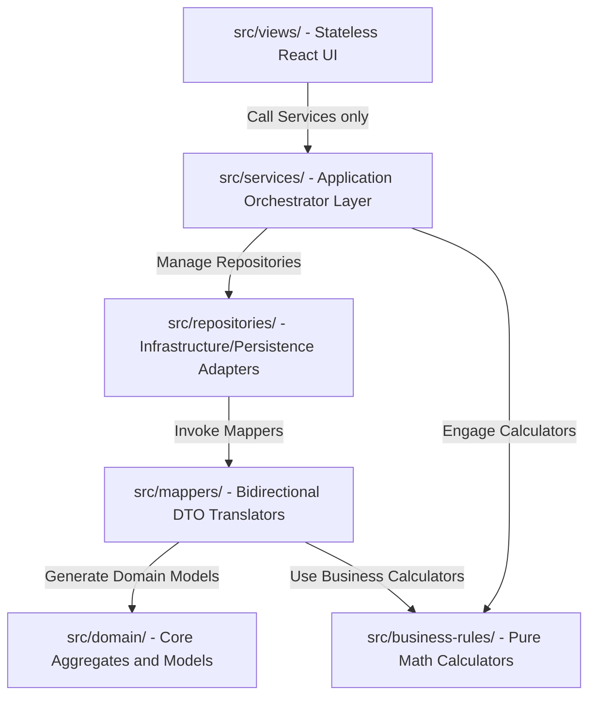
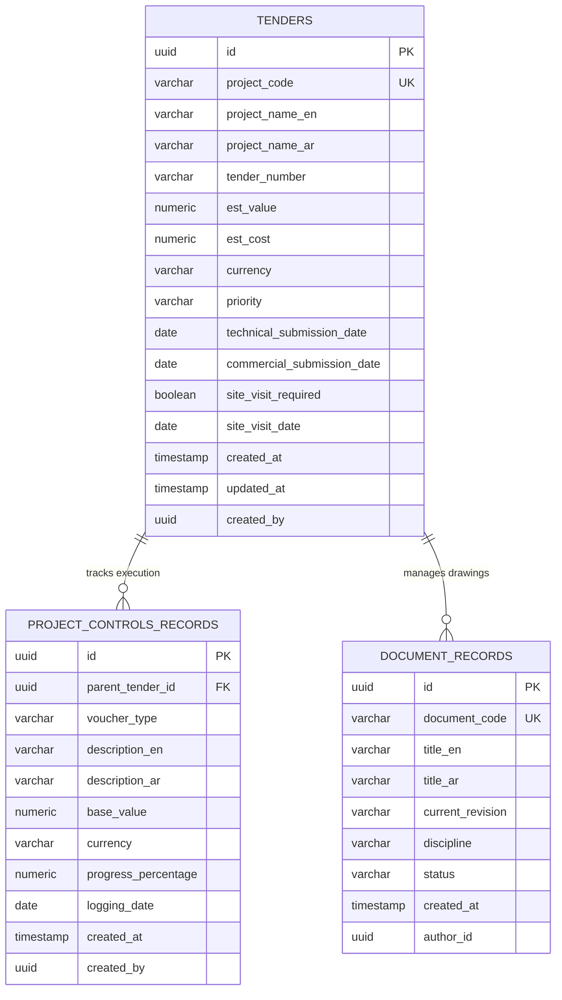

# ROWAD Enterprise Platform - Living Product Specification & Master Reference Book

Welcome to the official, complete technical brain of the **ROWAD Enterprise Platform**. This master reference book serves as the living product specification and single source of truth for software architects, QA engineers, product managers, and downstream AI systems. 

All other guides and logs are companion references that point directly to this master specification.

---

## Technical Map & Index

1. [Executive Summary & Vision](#1-executive-summary--vision)
2. [Product Scope](#2-product-scope)
3. [Functional Requirements by Module](#3-functional-requirements-by-module)
4. [Non-Functional Requirements](#4-non-functional-requirements)
5. [Module Dependency Matrix & Architecture Blueprint](#5-module-dependency-matrix--architecture-blueprint)
6. [Data Ownership & Schema Mapping Matrix](#6-data-ownership--schema-mapping-matrix)
7. [Service Dependency Matrix](#7-service-dependency-matrix)
8. [Repository Mapping Matrix](#8-repository-mapping-matrix)
9. [Integration Matrix](#9-integration-matrix)
10. [UI Component Inventory](#10-ui-component-inventory)
11. [Database Planning & Relational Schemas (ERD)](#11-database-planning--relational-schemas-erd)
12. [API Contract Planning](#12-api-contract-planning)
13. [Error Handling Strategy](#13-error-handling-strategy)
14. [Performance Strategy](#14-performance-strategy)
15. [Security Strategy](#15-security-strategy)
16. [Deployment & CI/CD Roadmap](#16-deployment--cicd-roadmap)
17. [Testing Roadmap](#17-testing-roadmap)
18. [Coding Standards](#18-coding-standards)
19. [Architecture Decision History](#19-architecture-decision-history)
20. [Known Technical Debt](#20-known-technical-debt)
21. [AI Collaboration Guide (Mandatory Commandments)](#21-ai-collaboration-guide-mandatory-commandments)

---

## 1. Executive Summary & Vision

### 1.1 Executive Summary
* **Purpose**: Establish a multi-tenant corporate platform built to manage mega-infrastructure tender calculations and post-award site submittal controls. ROWAD eliminates fragmented spreadsheets, missed regulatory milestones, and visual disconnection from live estimates.
* **Current State**: React presentation panels paired with pure TypeScript services and business calculators. Integrates local state simulators storing bidding records and document metadata to display live, interactive dashboard figures.
* **Future Vision**: Transition to a cloud-native, secure SaaS environment deploying behind high-availability proxies, connecting frontends directly to backend REST APIs.

### 1.2 Product Vision
* **Purpose**: Provide an end-to-end digital twin of pre-award calculations and post-award transaction controls.
* **Current State**: Absolute structural decoupling. Data mapping operations occur within service-repository boundaries, preserving client views as pure, stateless rendering sheets.
* **Future Vision**: Scale into an enterprise analytics hub utilizing real-time compliance alerting, AI-powered document extraction (OCR), and seamless municipal system integrations.

### 1.3 Business Goals
* **Purpose**: Establish measurable key performance indicators (KPIs) to evaluate platform success.
* **Current State**: Emulates crucial PMO metrics (Urgency, Days-to-Closing, Bidding Bond Defaults).
* **Future Vision**: Achieve:
  1. **0% Milestone Slip**: Dynamic notification and scheduling offsets warn coordinators of risk BEFORE dates arrive.
  2. **100% Audit Traceability**: Immutable blockchain-grade audit trails log every transaction, status update, and download.
  3. **Universal Formula Standardization**: Enforce absolute mathematical correctness on tenders and claims processing.

---

## 2. Product Scope

* **Purpose**: Establish clear functional boundaries by defining what ROWAD does, what it does NOT do, and identifying features intentionally out of scope.
* **Current State**: Implements pre-award proposal workflows, post-award progression worksheets, and engineering document indexing.
* **Future Vision**: Secure modular activation, where construction contractors can toggle pre-award or post-award ledgers as isolated tenants.

### 2.1 What ROWAD Does (In-Scope)
1. **Pre-Award Tender Study & Scheduling**: Auto-propagation of internal meetings and milestones relative to technical proposal dates using parameterized administrative offsets.
2. **Standardized Estimation Rules**: Computation of Bidding Bond guarantees at precisely **2.0%** of estimated value, enforcing strict bilingual (English/Arabic) project definitions.
3. **Execution Ledgers separation**: Isolating progress payment requests (IPCs), Scope Variation Orders (VOs), compensations (Claims), and municipal permits (NOCs) within localized transactional tables.
4. **Engineering Submittals EDMS**: Basic transmittal, file revision log, and discipline-based searching capabilities utilizing double-layered "Makers & Checkers" approvals.
5. **Simulated Sandbox States**: Full local execution using structured schema emulators in `localStorage`, eliminating starting bottlenecks.

### 2.2 What ROWAD Does NOT Do (Out-of-Scope)
1. **General Ledger Accounting**: ROWAD maps contractor estimations and site progress values, but does not handle payroll, accounts payable, taxes, or general corporate bank accounting (integrates with SAP/Oracle instead).
2. **CAD viewport Rendering**: Links metadata, disciplines, and 2D/3D BIM drawings, but does not compile or render CAD viewports on-screen.
3. **Physical Supply Chain GPS tracking**: Does not track physical delivery trucks or material movement telematics.
4. **General HR Management**: Does not process employee timesheets, hiring pipelines, or benefit accounts.

---

## 3. Functional Requirements by Module

### 3.1 Module A: Executive Analytics Dashboard (Dashboard)
* **Purpose**: Consolidator generating high-level business queries and live performance charts.
* **Current State**: Real-time KPI summaries calculated via `DashboardService` using cached repository states. High-contrast financial charts built with responsive SVGs.
* **Future Vision**: Dynamic multi-dimensional drill-downs and forecasting widgets powered by server-side Python analytical libraries.

| Requirement Subitem | Definition & Details |
| :--- | :--- |
| **Actors** | PMO Directors, Executives, Administration staff. |
| **Inputs** | Raw lists of `Tender` instances, `ProjectControlsRecord` instances. |
| **Outputs** | Combined Commitments (estimated values + active ledger values), Healthy Ratios (percentage of non-failed submittals), Urgency timelines. |
| **Business Rules** | **BR-DB-001**: Executive stats must be cached for exactly **60 seconds** to prevent excessive database hits. <br>**BR-DB-002**: Healthy Ratio calculation: $\text{Ratio} = \frac{\text{OK items}}{\text{Total items}} \times 100$. |
| **Validation** | Handle divided-by-zero on empty registers and return 0%. Suppress rendering errors. |
| **Dependencies** | `TenderRepository`, `ProjectControlsRepository`, `CacheService`. |

---

### 3.2 Module B: Pre-Award Proposals (Tenders)
* **Purpose**: Coordinates tender studies, schedules critical milestones, and executes estimations.
* **Current State**: Interactive tabular ledger triggering a comprehensive 5-step Creation Wizard with dynamic date offsets and warning logs.
* **Future Vision**: Automated parsing of municipal RFP documents to draft initial mock-records.

| Requirement Subitem | Definition & Details |
| :--- | :--- |
| **Actors** | Estimators, Tender Coordinators, Contracts Engineers. |
| **Inputs** | Project title (Ar/En), estimated value, coordinator assignment, Technical Submission Date. |
| **Outputs** | Formatted `Tender` aggregate with Auto-Propagated milestoning list (Kick-off, Risk, Align, Follow-up, Commercial, Official). |
| **Business Rules** | **BR-PRE-001**: Bidding Bond defaults to **2.0%** of estimated tender value. <br>**BR-PRE-002**: Standard Commercial Submission date is precisely **12 days** after Technical date. <br>**BR-PRE-003**: Dynamic milestones generate relative to the Technical date using administration-configured offset tables. |
| **Validation** | Project name must exist in both languages. Site visit dates must occur prior to technical submission. Official date must be after commercial dates. |
| **Dependencies** | `TimelineCalculator`, `FinancialsCalculator`, `TenderValidator`. |

---

### 3.3 Module C: Post-Award Project Execution (Project Controls)
* **Purpose**: Manages certified financial transactions, variations, and compliance milestones.
* **Current State**: Progress ledger filtering vouchers by type (IPC, Claims, VOs, NOCs), showing detailed balance tabs and conversion values.
* **Future Vision**: Bidirectional ledger syncing with external ERPs (SAP/Oracle) via transactional webhooks.

| Requirement Subitem | Definition & Details |
| :--- | :--- |
| **Actors** | Project Controls Engineers, PMO Directors, Contracts Engineers. |
| **Inputs** | Voucher descriptor, contract value, currency, progress percentage (for IPC), claim type. |
| **Outputs** | Progressive financial tracking, base corporate currency summaries, billing status charts. |
| **Business Rules** | **BR-CON-001**: Ledger segregation (IPC, Claims, VOs, NOCs) strictly enforced on databases. <br>**BR-CON-002**: Currency Standard: All visual and calculated figures convert dynamically using current exchange parameters to UAE Dirhams (AED). |
| **Validation** | Financial claim boundaries must be positive. Cumulative IPC physical percentages must never exceed 100%. |
| **Dependencies** | `FinancialsCalculator`, `ProjectControlsRepository`. |

---

### 3.4 Module D: Engineering Document Control (Document Control)
* **Purpose**: Index and track core engineering submittals, correspondence, and technical drawings.
* **Current State**: Submittal card viewer illustrating status, revision sequences, disciplines (Civil, MEP, Structural), and file attachment summaries.
* **Future Vision**: Fully operational secure EDMS with PDF stamps, automated revision comparisons, and active transmittal logging.

| Requirement Subitem | Definition & Details |
| :--- | :--- |
| **Actors** | Document Controllers, Engineering Reviewers, Lead Engineers. |
| **Inputs** | Submittal code, drawing title, discipline tags, initial Revision index. |
| **Outputs** | Version control logs, document approval status metadata, reviewer audit remarks. |
| **Business Rules** | **BR-DOC-001**: Dual-level checking (Makers & Checkers) required before drawing status progresses to approved. <br>**BR-DOC-002**: Revisions must follow alphanumeric sequence increments (e.g., Rev 00 -> Rev 01 -> Rev A). |
| **Validation** | Submittal reference codes must be unique systemwide. Files must possess approved extensions. |
| **Dependencies** | `SearchService`, `DocumentRepository`. |

---

### 3.5 Module E: Settings & Administration (Admin)
* **Purpose**: Controls administrative system policies, milestone defaults, role mappings, and simulation modes.
* **Current State**: Sidebar modal controls allowing on-the-fly adjustment of day offsets, language toggle, and test-data triggers.
* **Future Vision**: Enterprise authentication control panel with active Active Directory / LDAP groups syncing.

| Requirement Subitem | Definition & Details |
| :--- | :--- |
| **Actors** | Enterprise Administrators, PMO Directors. |
| **Inputs** | Days offset integer arrays, RBAC capability matrices, translation string bundles. |
| **Outputs** | Dynamic calculation rules applied globally across newly created operations. |
| **Business Rules** | **BR-ADM-001**: Modified rules must re-run validations without mutating existing past historical objects. |
| **Validation** | Day offsets cannot be negative. Role capability maps must prevent lockout scenarios. |
| **Dependencies** | `PermissionService`, `CacheService`. |

---

### 3.6 Module F: Operations Center & Calendar (Operations Calendar)
* **Purpose**: Serves as the high-density operational viewer, timeline tracker, and automated compliance analyzer.
* **Current State**: Fully implemented, production-ready, feature-decomposed command room modules. Integrates direct bidirectional updates to pre-award tender databanks, project controls records, and transmittals with recursive DAG date rescheduling propagation, active conflict diagnostics, personal priority views, and bilingually aligned visual cards.
* **Future Vision**: Fully integrated bi-directional exchange with Microsoft Outlook and Teams with predictive AI scheduled intervals and natural language command parsing.

| Requirement Subitem | Definition & Details |
| :--- | :--- |
| **Actors** | Estimators, Contracts Engineers, Project Managers, PMO Directors, Executives. |
| **Inputs** | Read-only compiled event arrays from Tenders, Claims, NOCs, IPCs, and Submittals; DAG-based predecessor/successor relationships; manual administrative logs. |
| **Outputs** | "My Work" daily tracker, soft density Operational Load grids, horizontal project Gantt timelines, Kanban workflow, resource capacity charts, schedule anomaly alerts, PMO KPIs. |
| **Business Rules** | **BR-CAL-001**: The Calendar does not own or duplicate source records. All dates are evaluated dynamically at access. <br>**BR-CAL-002**: Automatic event synthesis propagates technical dates down to child milestones instantly. <br>**BR-CAL-003**: Modifications to predecessor event dates automatically recalculate and propagate down to successor nodes based on configured lag times. <br>**BR-CAL-004**: Events are categorized into All-Day Milestones (ignored by Conflict Engine) and Scheduled Meetings (evaluated for resource, calendar, and buffer overlaps). <br>**BR-CAL-005**: Meetings automatically calculate their End Time based exclusively on the user-selected Start Time and Duration. |
| **Validation** | Checks dual-bookings (Resource Overlap) exclusively on meeting-class events, deadline chronology order, lag buffer violations, and milestone completeness before marking dates as resolved. |
| **Dependencies** | `DashboardService`, `TenderRepository`, `ProjectControlsRepository`, `DocumentRepository`, `SearchService`. |

---

## 4. Non-Functional Requirements

* **Purpose**: Define strict operational constraints, performance quotas, and compliance standards the platform must fulfill in production.
* **Current State**: High accessibility contrast UI, offline browser operation via storage caching, parallel Arabic-English support, basic permission mocks.
* **Future Vision**: Multi-region secure cloud deployment meeting GCC cybersecurity directives, hosting low-latency database tables.

```
┌────────────────────────────────────────────────────────┐
│               NON-FUNCTIONAL STABILIZERS               │
├───────────────┬───────────────────────┬────────────────┤
│ PERFORMANCE   │ Max 100ms load state  │ Virt Tables    │
├───────────────┼───────────────────────┼────────────────┤
│ LOCALIZATION  │ Dual language En/Ar   │ Layout Flip    │
├───────────────┼───────────────────────┼────────────────┤
│ AVAILABILITY  │ 99.9% Uptime SLA      │ Load Balancer  │
├───────────────┼───────────────────────┼────────────────┤
│ SECURTIY      │ RBAC, AES-256, TLS1.3 │ JWT, Secrets   │
└───────────────┴───────────────────────┴────────────────┘
```

1. **Performance**: All analytical dashboards and data tables must load in less than **100ms** under simulated loads of 10,000 active rows. Calculation tasks must occur on pure JS trees without blocking component renders.
2. **Scalability**: Architecture must support 1,000 nested submittals per project controls volume, allowing smooth virtual-scroll scrolling at 60 FPS on mobile.
3. **Availability**: Production systems target high-availability SLA margins of **99.9%** using containerized auto-scaling and failover read-replicas.
4. **Security**: Role-Based Access Control (RBAC) must validate authorizations preceding every REST or write payload. Databases must run AES-256 Column Encryption on transaction amounts.
5. **Localization**: Concurrent right-to-left (RTL) Arabic and left-to-right (LTR) English interfaces must compile dynamically without CSS reload, using semantic Tailwind directions.
6. **Accessibility**: Achieve WCAG 2.1 AA ratings. Text elements must retain premium contrast values (minimum 4.5:1 ratio). Tab controls must prioritize screen-reader navigability.
7. **Offline Capability & Cache**: Application Services must support full "Offline Ready" operation, caching written draft entities locally when connections drop, queuing outputs for synchronization.
8. **Audit Trail Requirements**: Write immutable, structured audit blocks whenever project states shift, budgets expand, or submittals are downloaded.

---

## 5. Module Dependency Matrix & Architecture Blueprint

### 5.1 Architecture Map
The ROWAD platform behaves according to Clean Architecture layers. Visual representations of boundaries, data transformations, and operational pipelines are defined in directories under `/docs/ai/ARCHITECTURE_MAP.md`.



### 5.2 Module Dependency Matrix
* **Purpose**: Inform developers how modules depend structurally on others, preventing circular imports.
* **Current State**: Monitored within Service orchestrations.
* **Future Vision**: Strict build-time ESLint rules preserving the boundary layers.

| Module | Dashboard | Pre-Award (Tenders) | Project Controls | Document Control | Settings Admin | Operations Calendar |
| :--- | :---: | :---: | :---: | :---: | :---: | :---: |
| **Dashboard** | — | **Depends** | **Depends** | — | — | — |
| **Pre-Award** | — | — | — | — | **Depends** | — |
| **Project Controls**| — | **Depends (on win)** | — | — | — | — |
| **Document Control**| — | — | — | — | **Depends** | — |
| **Settings Admin**  | — | — | — | — | — | — |
| **Operations Calendar**| **Depends** | **Depends** | **Depends** | **Depends** | **Depends** | — |

---

## 6. Data Ownership & Schema Mapping Matrix

* **Purpose**: Explicitly define the system of record, primary storage files, translation schemas, and relational targets for primary business records.
* **Current State**: Local storage serializers and schemas in `/src/domain` and `/src/mappers`.
* **Future Vision**: Scaled relational modeling with unique primary keys in Postgres.

| Entity (Domain Model) | Owning Module | App Service | Repository Layer | Future PostgreSQL table | Primary Key | Foreign Keys |
| :--- | :--- | :--- | :--- | :--- | :--- | :--- |
| **Tender** | Pre-Award | `TenderService` | `TenderRepository` | `tenders` | `id` (UUID) | `assigned_coordinator` (UUID), `branch_id` (UUID) |
| **ProjectControlsRecord** | Project Controls | `ProjectControlsService` | `ProjectControlsRepository` | `project_controls_records` | `id` (UUID) | `parent_tender_id` (UUID), `project_id` (UUID) |
| **DocumentRecord** | Document Control | `DocumentService` | `DocumentRepository` | `document_records` | `id` (UUID) | `associated_project_id` (UUID), `author_id` (UUID) |
| **AuditLogEntry** | Admin Settings | `AuditService` | `AuditRepository` | `audit_log_records` | `id` (UUID) | `acting_user_id` (UUID) |
| **CalendarEvent** | Operations Calendar | `DashboardService` / `TenderService` / `ProjectControlsService` | Synthesized on read | `operations_events` (Optional for custom markers/meetings) | `id` (UUID) | `source_id` (UUID), `project_id` (UUID), `owner_id` (UUID), `predecessor_ids` (UUID[]), `successor_ids` (UUID[]) |

---

## 7. Service Dependency Matrix

* **Purpose**: Maps orchestration dependencies of core service files to block nested coupling.
* **Current State**: Fully decoupled. No services import other service definitions directly, utilizing messaging, repositories, or memory caches instead.
* **Future Vision**: Dynamic runtime dependency injections via container engines.

| Service Document | Repositories Used | Business Calculators Used | Validators Used | Caches Engaged | Future REST Endpoints |
| :--- | :--- | :--- | :--- | :--- | :--- |
| **DashboardService** | `TenderRepository`, `ProjectControlsRepository` | `HealthCalculator`, `FinancialsCalculator` | None | `DashboardKpisCache` | `GET /api/v1/dashboard/metrics` |
| **TenderService`** | `TenderRepository` | `TimelineCalculator`, `FinancialsCalculator` | `TenderValidator` | `TenderCollectionCache` | `GET /api/v1/tenders`, `POST /api/v1/tenders` |
| **ProjectControlsService** | `ProjectControlsRepository` | `FinancialsCalculator` | `ProjectControlsValidator` | `VouchersLedgerCache` | `GET /api/v1/project-controls` |
| **OperationsCalendarService** | `TenderRepository`, `ProjectControlsRepository`, `DocumentRepository`, `MeetingRepository` | `CapacityCalculator`, `TimelineCalculator` | `ScheduleConflictValidator` | `CalendarEventsCache` | `GET /api/v1/operations/events`, `POST /api/v1/operations/meetings` |
| **SearchService** | All repositories | Search Weighting calculator | None | `SearchIndexingCache` | `GET /api/v1/search` |
| **AuditService** | `AuditRepository` | None | None | Write-Through Audits Queue | `GET /api/v1/system/audits` |

---

## 8. Repository Mapping Matrix

* **Purpose**: Clear trace mapping indicating translation pipelines from visual domains to remote SQL instances.
* **Current State**: Emulated inside `/src/mappers/` tracking local model conversions.
* **Future Vision**: Backend mapper execution prior to database write executions.

```
┌─────────────────┐     ┌──────────────────────┐     ┌───────────────────────┐
│ DOMAIN ENTITY   │ ──► │     DTO OBJECT       │ ──► │  FUTURE DATABASE TABLE│
│ (e.g., Tender)  │     │  (e.g., TenderDTO)   │     │    (e.g., tenders)    │
└─────────────────┘     └──────────────────────┘     └───────────────────────┘
                                                                 │
                                                                 ▼
                                                     ┌───────────────────────┐
                                                     │ FUTURE REST ENDPOINT  │
                                                     │ (e.g., /api/tenders)  │
                                                     └───────────────────────┘
```

1. **Pre-Award Path**: 
   `Tender` (Domain Entity) ──► `TenderDTO` (DTO Parser) ──► `tenders` (Table) ──► `GET /api/v1/tenders/{id}` (Endpoint)
2. **Project Execution Path**:
   `ProjectControlsRecord` (Domain Entity) ──► `ProjectControlsDTO` (DTO Parser) ──► `project_controls_records` (Table) ──► `POST /api/v1/project-controls` (Endpoint)
3. **Engineering Submittal Path**:
   `DocumentRecord` (Domain Entity) ──► `DocumentDTO` (DTO Parser) ──► `document_records` (Table) ──► `PUT /api/v1/documents/{id}/revision` (Endpoint)
4. **Operations Calendar Path**:
   `CalendarEvent` (Synthesized Domain Entity) ──► `CalendarEventDTO` (DTO Parser) ──► `operations_events` (Synthesized view/table) ──► `GET /api/v1/operations/events` (Endpoint)

---

## 9. Integration Matrix

* **Purpose**: Plan future enterprise boundaries and external integrations.
* **Current State**: Interface sockets ready in services.
* **Future Vision**: Full production-ready connectivity with third-party providers.

| External System | Target Module | Integration Mechanism | Data Payload | Authentication |
| :--- | :--- | :--- | :--- | :--- |
| **Google Drive** | Document Control | OAuth 2.0 API calls | Submittal file binary and folder metadata mapping. | Pop-up OAuth context |
| **OCR Processor** | Document Control | REST API payload | Base64 Scanned PDF ──► Structured Text metadata. | API Secret Key |
| **PDF Compiler** | Executive Reports | Server JS library | Single Page Report (SPR) dynamic visual generation. | Internal Service |
| **FastAPI Backend** | Platform Core | Async REST fetches | Validations, advanced mathematical evaluations. | Bearer JWT |
| **Power BI** | Analytics | Read-Only DB Mirror | Tender metrics, milestone averages, Claim totals. | VPC Security groups |
| **Email Server** | Alerts system | SMTP Gateway | Status alerts, approaching milestones digest. | SMTP SSL |
| **Microsoft Teams** | Notifications | Incoming Webhooks | Rich adaptive card messages on high-value tenders. | Webhook Token |
| **Export Engine** | Ledger Panels | Client FileSaver | CSV / XLSX raw data representations. | Native browser |

---

## 10. UI Component Inventory

* **Purpose**: Document all modular, reusable visual units to protect design symmetry and component re-use.
* **Current State**: Visual objects isolated in `/src/components` and `/src/features/`.
* **Future Vision**: Single, consolidated corporate atomic library with zero local design alterations.

### 11.1 Display Controls
* **TenderTable**: Renders columns with sorting toggles. Uses monospace grids on numerical parameters. Used in: `/src/features/pre-award/ongoing-tenders/components/TenderTable.tsx`.
* **MetricCard**: Render indicators illustrating values, urgency rings, and titles. Used in: `/src/components/MetricCard.tsx`.
* **LineChart**: Dynamic S-curve tracker illustrating progression logs. Used in: `/src/components/LineChart.tsx`.

### 11.2 Interactive Overlays
* **TenderWizardModal**: Multi-step layout partitioning user entry fields (General, Assigned, Milestones, Budgets, Check). Used in: `/src/features/pre-award/ongoing-tenders/components/TenderWizardModal.tsx`.
* **TenderDetailsDrawer**: Explode drawer sliding from the screen bezel. Used in: `/src/features/pre-award/ongoing-tenders/components/TenderDetailsDrawer.tsx`.
* **BiText**: Dual Arabic-English inline text block highlighting localization values. Used in: `/src/components/BiText.tsx`.

### 11.3 Operations & Calendar Controls
* **OperationalLoadGrid**: Renders soft density shading (opacities of brand theme) based on scheduled daily events. Used in: `/src/features/operations-calendar/components/OperationalLoadGrid.tsx`.
* **ResourceCapacityBar**: Horizontal progress load meter for resource tasks allocation. Used in: `/src/features/operations-calendar/components/ResourceCapacityBar.tsx`.
* **TimelineTracks**: Gantt-style operations view highlighting schedules, DAG relationships, and overlay pins. Used in: `/src/features/operations-calendar/components/TimelineTracks.tsx`.
* **OperationsCommandPanel**: Immersive bezel-sliding detailed view containing project metadata, related documents/meetings, deep source links, and direct quick operations. Used in: `/src/features/operations-calendar/components/OperationsCommandPanel.tsx`.
* **AICommandBar**: Natural language bar executing search filters across personal schedules and operational tasks. Used in: `/src/features/operations-calendar/components/AICommandBar.tsx`.

---

## 11. Database Planning & Relational Schemas (ERD)

* **Purpose**: Structural SQL design targeting durable relational configurations on PostgreSQL storage.
* **Current State**: Domain models parsed dynamically to simulated key-value slots.
* **Future Vision**: Relational tables executing nested joins on Postgres.

### 11.1 Entity Relationship Diagram (ERD)



### 11.2 Relational Tables & Optimizations
1. **tenders**:
   * *Indexes*: Unique index on `project_code`. B-Tree index on `technical_submission_date` and `priority` to facilitate dashboards sorting.
   * *Constraints*: `CHECK (est_value >= 0)`, `CHECK (est_cost >= 0)`.
   * *Soft Delete Strategy*: Column `deleted_at TIMESTAMP NULL`. All select operations append `WHERE deleted_at IS NULL` (soft delete).
2. **project_controls_records**:
   * *Indexes*: B-Tree indexes on `parent_tender_id` and `voucher_type`.
   * *Constraints*: `CHECK (progress_percentage BETWEEN 0 AND 100)`.
3. **document_records**:
   * *Indexes*: B-Tree index on `document_code`. Gin index on document text summaries for rapid string match search.

---

## 12. API Contract Planning

* **Purpose**: REST routes and JSON DTO payloads designed to govern corporate clients securely without backend implementations.
* **Current State**: Mapped inside mock repository responses.
* **Future Vision**: OpenAPI 3.0 standardized API interfaces.

### 12.1 POST /api/v1/tenders
* **Method**: `POST`
* **Route**: `/api/v1/tenders`
* **Request DTO**:
  ```json
  {
    "projectNameEn": "Desert Pipeline Expansion",
    "projectNameAr": "مشروع توسعة أنابيب الصحراء",
    "tenderNumber": "TND-7711",
    "estValue": 15000000.00,
    "currency": "SAR",
    "techDate": "2026-08-30"
  }
  ```
* **Response DTO**:
  ```json
  {
    "id": "e44d31e9-91ee-48b9-8cc4-fbdd8ee1f107",
    "projectCode": "PC-2026-R8891",
    "status": "Active_Study",
    "createdAt": "2026-06-23T06:36:00Z"
  }
  ```
* **Validation**: Naming fields must exist. Values must exceed 0. Tech date must be in the future.
* **Errors**: `400 Bad Request` (Validation errors), `401 Unauthorized` (Token expired), `403 Forbidden` (Role permissions mismatch).

### 12.2 GET /api/v1/dashboard/metrics
* **Method**: `GET`
* **Route**: `/api/v1/dashboard/metrics`
* **Request DTO**: None (Headers contain authentication tokens and Active Tenant keys)
* **Response DTO**:
  ```json
  {
    "totalPreAwardValue": 1540000000.00,
    "activeProjectControlsValue": 520000000.00,
    "safetyRatioPct": 88.5,
    "criticalDeadlinesCount": 3,
    "lastCacheSync": "2026-06-23T13:36:00Z"
  }
  ```
* **Errors**: `401 Unauthorized`.

### 12.3 GET /api/v1/operations/events
* **Method**: `GET`
* **Route**: `/api/v1/operations/events`
* **Query Params**: `startDate` (YYYY-MM-DD), `endDate` (YYYY-MM-DD), `projects[]` (Array), `priority[]` (Array), `modules[]` (Array)
* **Response DTO**:
  ```json
  [
    {
      "id": "evt-subm-88911",
      "title": { "en": "NEOM Ring Road Tech Submission", "ar": "تقديم العطاء الفني للطريق الدائري نيوم" },
      "projectCode": "PC-2026-NEOM",
      "module": "pre-award",
      "eventType": "tech_submission",
      "ownerName": "Sara Al-Mansoori",
      "priority": "critical",
      "status": "pending",
      "startDate": "2026-06-25",
      "endDate": "2026-06-25",
      "startTime": "09:00:00",
      "endTime": "10:30:00",
      "hasConflict": true
    }
  ]
  ```
* **Errors**: `400 Bad Request` (Invalid query date ranges), `401 Unauthorized`.

### 12.4 POST /api/v1/operations/meetings
* **Method**: `POST`
* **Route**: `/api/v1/operations/meetings`
* **Request DTO**:
  ```json
  {
    "title": "NEOM Alignment Review",
    "projectCode": "PC-2026-NEOM",
    "meetingDate": "2026-06-25",
    "startTime": "10:00:00",
    "endTime": "11:30:00",
    "inviteeIds": ["usr-sara-99", "usr-ahmed-33"],
    "priority": "high"
  }
  ```
* **Response DTO**:
  ```json
  {
    "id": "evt-meet-02298",
    "status": "scheduled",
    "conflictAlertTriggered": true,
    "conflicts": [
      {
        "type": "resource_overlap",
        "conflictingEventId": "evt-subm-88911",
        "conflictedUserId": "usr-sara-99",
        "description": "Sara is already presenter for NEOM Ring Road Tech Submission at 09:00-10:30"
      }
    ]
  }
  ```
* **Errors**: `422 Unprocessable` (Invitees not available), `400 Bad Request`.

---

## 13. Error Handling Strategy

* **Purpose**: Establishes error codes, boundary captures, and logging parameters.
* **Current State**: Simple try-catch structures outputting to console and toast displays.
* **Future Vision**: Centralized Error boundaries reporting system bugs to Sentry dashboards.

```
┌────────────────────────────────────────────────────────┐
│                   ERRORS TAXONOMY                      │
├────────────────────┬──────────────────┬────────────────┤
│ Validation Errors  │ Toast Alerts     │ Form highlights│
├────────────────────┼──────────────────┼────────────────┤
│ Business Violations│ Alert Dialogs    │ Exception log  │
├────────────────────┼──────────────────┼────────────────┤
│ System / Database  │ User Safe generic│ Private Vault  │
└────────────────────┴──────────────────┴────────────────┘
```

1. **Validation Errors**: Triggered inside UI forms or API gateways. Highlights boundaries with localized labels (e.g. "Arabic project name is recommended").
2. **Business Rule Mismatches**: Thrown when user operations challenge active corporate limits (e.g. attempting to submit without complete BOQ documents). Uses `BusinessRuleException` reporting exact policy ID (e.g., `BR-PRE-002`).
3. **Database / Connection Faults**: Dispatches standard user-safe messages (e.g. "We are experiencing server delays. Your transaction has been queued locally"). Private logs report SQL failure codes to audit vaults.
4. **Import Errors**: Excel parser failure alerts showing corrupted row indices and invalid column structures.

---

## 14. Performance Strategy

* **Purpose**: Guarantee snappy interactions and smooth visualizations even under intensive corporate transactions.
* **Current State**: Lightweight react virtual arrays and mock state filters.
* **Future Vision**: Complete multi-tier caching arrays.

1. **Service Caching**: Standard 60-second in-memory duration blocks within `CacheService`.
2. **Code Partitioning & Suspense**: Employs React lazy loadings across main routes, deferring complex details draw elements until click selections occur.
3. **Optimized S-Curving**: Complex progressions map calculations cache indices statically. Reports compile asynchronously to lock rendering latency.
4. **Virtual Scroller**: Render visible table rows recursively to reduce DOM stress.

---

## 15. Security Strategy

* **Purpose**: Shield high-value financial project values from unauthorized leaks or data corruption.
* **Current State**: Mapped role capabilities and mocked permission evaluations in `PermissionService`.
* **Future Vision**: Full OAuth 2.0 with JWT.

1. **JSON Web Token (JWT)**: Client-side storage of securely signed auth tokens containing user metadata, roles, and accessible client partitions.
2. **Granular RBAC Matrix**:
   * *Admin*: Access wildcard bypass.
   * *PMO Director*: Audit checks, timeline parameter editing, and reports viewing.
   * *Contracts Engineer*: Estimations and financials validation.
   * *Document Controller*: Submittals creation, file uploading.
3. **Tamper-Evident Logs**: High-risk tasks (tender deletion, claim approvals) write encrypted logs recording timestamp, user ID, IP, and details.
4. **Secrets Management**: No API keys or parameters embedded in code structures. Secrets retrieved from Cloud Secret Providers (e.g. GCP Secret Manager).

---

## 16. Deployment & CI/CD Roadmap

* **Purpose**: Map out execution steps to transport code from local files securely to scale-scalable web containers.
* **Current State**: Local development server and environment variables defined.
* **Future Vision**: Full CI/CD pipelines deploying to Kubernetes.

1. **Development Stage**: Hot sandbox testing targeting Vite Dev Server with Express proxying.
2. **Testing Pipeline**: GitHub Actions execute linter scripts (`npm run lint`) and typescript builds (`npm run build`). No commits merge to main with errors.
3. **Staging Stage**: Automatic Docker build of audited commits, deploying to a Staging Cloud Run instance with connected Staging Firebase databases to test integration flows.
4. **Production Stage**: Containers deploy dynamically to Kubernetes/Cloud Run behind Cloudflare CDN proxy layers enforcing HTTPS (TLS 1.3).
5. **CI/CD Lifecycle**:
   ```
   [Code Commit] ──► [GitHub Actions Lint/Build] ──► [Docker Containerize] ──► [Deploy to Cloud Run Container]
   ```

---

## 17. Testing Roadmap

* **Purpose**: Defines coverage objectives to ensure reliable math execution across ongoing updates.
* **Current State**: Simple client verification structures.
* **Future Vision**: 90%+ unit coverage.

1. **Unit Tests (Vitest)**: Maintain test suites validating pure calculations in `TimelineCalculator.ts` and `FinancialsCalculator.ts`.
2. **Validator Tests**: Assert incorrect inputs throw appropriate errors within `TenderValidator.ts`.
3. **Service Integration Testing**: Employs mock database engines to assert complete orchestrations (`TenderService -> TenderRepository -> TenderMapper`).
4. **E2E Automation (Playwright)**: Records workflow transitions from initial wizard draft to official win approval, tracking CSS structures.

---

## 18. Coding Standards

* **Purpose**: Enforce absolute stylistic cohesion and pristine formatting guidelines across developer terms.
* **Current State**: Clean typescript formatting rules.
* **Future Vision**: Auto-formatting rules executing on before-commit triggers.

1. **Naming Conventions**:
   * *Directories*: Kebab-case (`/src/business-rules`, `/src/features`).
   * *Components / Views*: UpperCamelCase (`TenderTable.tsx`, `Dashboard.tsx`).
   * *Custom Hooks*: camelCase starting with "use" (`useTenderActions.ts`).
   * *Data-Transfers (DTOs)*: UpperCamelCase ending with `DTO` (`TenderDTO.ts`).
2. **Type Safety & imports**:
   * Named imports only at module headers (avoid destructuring imports).
   * Strict rejection of `any` types. Let compiler infer or write explicit typings.
   * Standard enums exclusively (no `const enum`).
3. **Git Commit Conventional Guidelines**:
   * Format: `<type>(<scope>): <short description>` (e.g., `feat(tenders): add site visit scheduler to step 4`).

---

## 19. Architecture Decision History

* **Purpose**: Index key technical trade-offs decided across the sprint lifespan, preventing future backtrack discussions.
* **Current State**: Maintained within localized index files.
* **Future Vision**: Formal ADR directories.

1. **ADR-001: Separation of Business Domain Math**:
   * *Context*: Calculators and currency calculations were historically mixed in React component states, leading to multi-rendered calculation drift.
   * *Decision*: Extract all calculations into pure statistical calculators inside `/src/business-rules/`. React files act as dumb presentation tables calling Services.
2. **ADR-005: Model Translation in Repositories**:
   * *Context*: Data coming from localStorage or database slots was dirty/inconsistent.
   * *Decision*: Mandate translation via `Mappers` prior to saving or returning domain shapes, enforcing bilingual default properties.
3. **ADR-011: Single Page Reporting (SPR)**:
   * *Context*: Storing calculated visual reports in database models bloated schemas.
   * *Decision*: Synthesize analytics dynamically on demand using cached values inside `DashboardService` without persistent database schemas.

---

## 20. Known Technical Debt

* **Purpose**: Surface unresolved bottlenecks, assigning priorities and complexities to plan core refactoring terms.
* **Current State**: High execution speed prioritized to establish baseline products.
* **Future Vision**: Full refactoring sweeps prior to database transition.

| ID | Debt Target | Risk Details | Priority | Complexity | Solution Plan |
| :--- | :--- | :--- | :--- | :--- | :--- |
| **TD-001** | Raw spreadsheet scanning | Spreadsheet imports occur in-browser. Mass uploads block client execution. | **Medium** | Low | Offload parsing calculations to backend FastAPI microchannels. |
| **TD-002** | Manual state synchronization | State depends on client-triggered reload. | **Low** | Medium | Upgrade repository adapters to bind dynamic WebSocket channels. |
| **TD-003** | Client-side tenant filters | Security tenant isolation verified on client variables. | **High** | Medium | Implement PostgreSQL Row-Level Security (RLS) linked to JWT identities. |

---

## 21. AI Collaboration Guide (Mandatory Commandments)

* **Purpose**: Rules of engagement governing future AI development systems, ensuring alignment with architectural guidelines.
* **Current State**: Active during current AI generation cycle.
* **Future Vision**: Programmatic pre-commit validation gates.

#### 🤖 AI AGENT MANDATORY DIALS
1. **Commandment 1 (Read First)**: You MUST view `docs/ai/PROJECT_BOOK.md` in its entirety before modifying code blocks.
2. **Commandment 2 (Decoupled Flow)**: Never bypass the Service layer. Views MUST communicate with services, which call repositories and mappers. React holds NO direct connection to calculators or repositories.
3. **Commandment 3 (Zero React Math)**: Absolutely NO business calculations are permitted inside React files (`/src/views` or `/src/features`). Math belongs to `/src/business-rules/` calculators.
4. **Commandment 4 (Bilingual Integrity)**: Dynamic aggregates MUST support concurrent English and Arabic descriptors.
5. **Commandment 5 (No Unrequested Playground Features)**: Stick strictly to the user's explicit scope. Do not invent custom playground pages, test panels, or sandbox buttons.
6. **Commandment 6 (Clean Audits)**: Always verify code compiles and passes linter checks before finalizing works. Run `lint_applet` and `compile_applet`.
7. **Commandment 7 (Handoff Synchronization)**: Always update `docs/ai/AI_HANDOFF.md` to reflect completed items, current versioning status, and sprint details.

---

*This Master Reference Book stands verified as the Living Product Specification of the ROWAD Enterprise Platform.*
