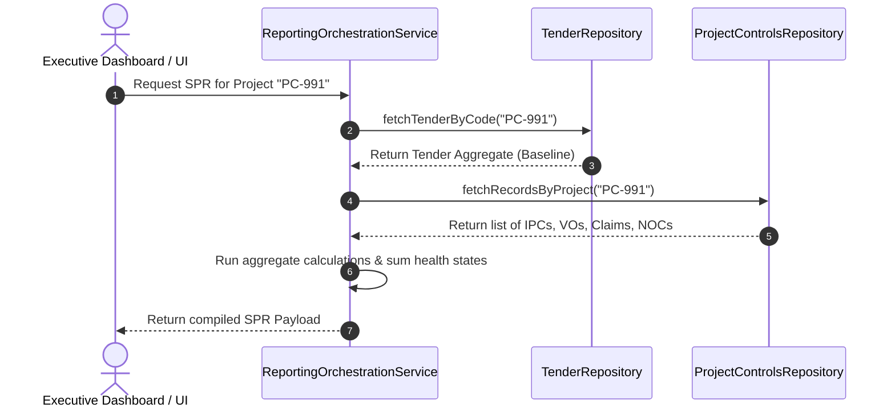

# Product Specification: Single Paper Report (SPR)
**Subdomain:** Project Controls - Executive Reporting  
**Classification:** Generated Business Report (Non-Transactional Entity)  
**Status:** Approved & Refined Specification  

---

## 1. System Context & Purpose
The business clarification establishes that **SPR (Single Paper Report)** is not a transactional domain entity. It is a highly optimized, dynamically compiled executive report that aggregates commercial and operational metrics across different business phases (Pre-Award and active Site Execution).

Because an SPR is pure presentation-oriented data compiled on-the-fly, **it has no dedicated CRUD database tables, no state-modification pipelines, and no dedicated repositories**. Instead, it computes and aggregates live data from the following real transaction models:
*   `Tender` aggregate (Pre-Award commercial baselines, estimated value, client configurations).
*   `ProjectControlsRecord` items (Live site variations, payments certified, pending contractual claims, risk indicators).

---

## 2. Project Controls Architecture Diagram

```text
Project Controls Subsystem
├── Transactions (Persistent Entity Records managed in SQLAlchemy/PostgreSQL)
│     ├── IPC (Interim Payment Certificate)
│     ├── Claim
│     ├── Variation Order (VO)
│     └── NOC (No Objection Certificate)
│
└── Reports (Generated Dynamically, No CRUD or Standalone Repository)
      └── SPR (Single Paper Report)
```

---

## 3. Dynamic Compilation & Logic Flow

An SPR compiles metrics dynamically upon request via a specialized Reporting Orchestration Service:



---

## 4. Calculated Reporting Aggregates
The dynamically constructed SPR JSON payload groups properties into several logical report sections described below:

### A. General Project Baseline Info (Retrieved from Tender)
*   **Project Code**: From `Tender.projectCode`.
*   **Client & Location**: From `Tender.general.clientName` and `Tender.general.location`.
*   **Original Budget Baseline**: From `Tender.financials.estimatedValue`.

### B. Live Financial Transposition (Aggregated dynamically from Transactions)
*   **Total Certified Value ($V_{cert}$)**: Summarizes all `IPC` records in `Approved` or `Paid` states:
    $$V_{cert} = \sum_{ipc \in \text{IPCs}} valueAED(ipc)$$
*   **Active Variation Inflows ($V_{vo}$)**: Sums all `Variation Order` records currently approved:
    $$V_{vo} = \sum_{vo \in \text{VOs}} valueAED(vo)$$
*   **Pending Financial Exposure ($V_{claims}$)**: Sums all unresolved client disputes or pending recovery items in the `Claim` records pool.

### C. Operational Execution Diagnostics
*   **Physical Progress Percentage ($\overline{P}_{phys}$)**: The weighted average of physical installation progress across the active site modules:
    $$\overline{P}_{phys} = \frac{\sum_{rec \in \text{Transactions}} progress(rec)}{\text{Count of Transactions}}$$
*   **Consolidated Operational Alerts**: Dynamically parses the list of NOCs and transactional health states. If any active transaction is marked `Urgent` or a critical NOC remains pending for $>15$ days, the SPR flags the diagnostic status as `Urgent attention required`.

---

## 5. Architectural Safeguards
1.  **Read-Only Integrity**: Because SPR is a report, direct payload injection or edit operations are strictly blocked. The UI may not send an SPR back to any repository "save" operation.
2.  **No CRUD Exposure**: There is **no SPR Repository**. Database engines do not feature an `spr` table. This protects the database schema from duplication and ensures financial consistency (all report values represent a true mathematical reflection of active database ledgers).
3.  **Dynamic Rendering**: Since the SPR represents a lightweight view summary, any updates to individual transactional IPCs, Claims, or Tenders instantly update the compiled SPR on the next rendering pass.

---

## 6. Future Extension Roadmap
*   **Export as Corporate Executive PDF**: Integrate serverless print scripts (Playwright / Puppeteer) to compile the dynamic page into a standardized, one-page premium physical print layout.
*   **Gemini Executive Summary Integration**: Push the compiled SPR numerical boundaries through a secure backend GPT/Gemini API block, generating instant human-readable progress statements for C-level directors automatically.
