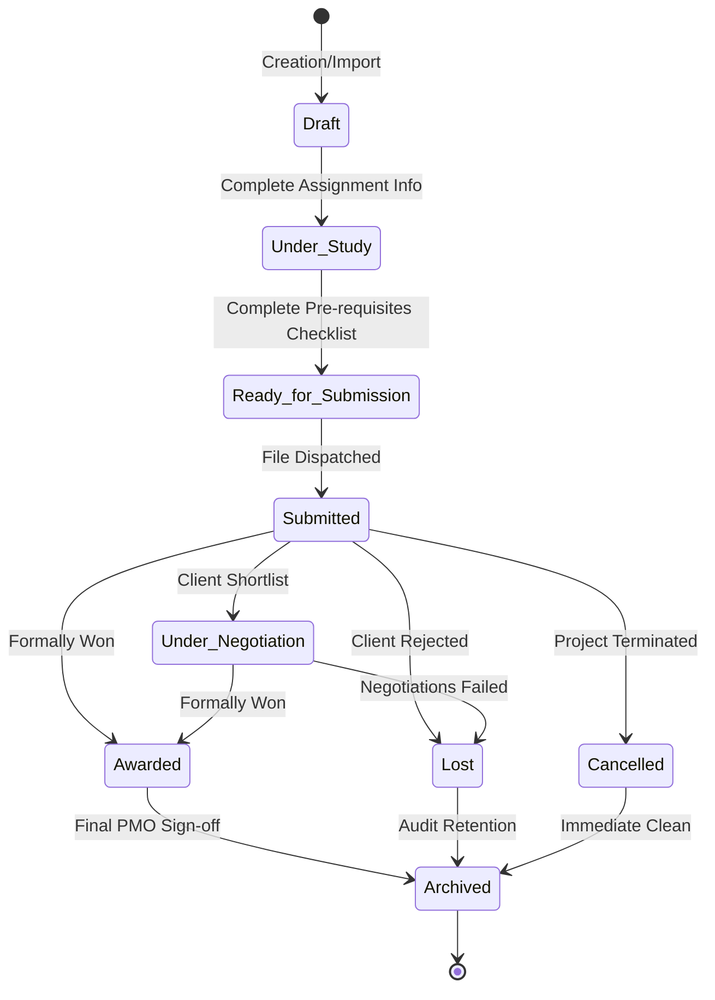
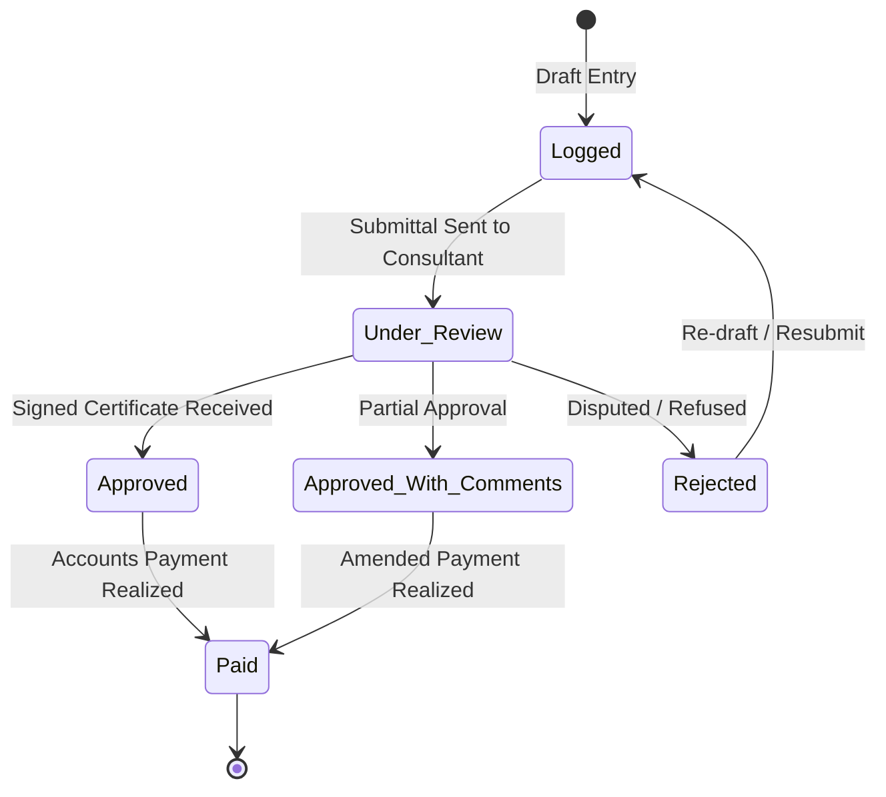

# Workflow State Machines Specification
**Category:** State Machine Engineering & Lifecycle Control  
**Status:** Approved Product Specification  

---

## 1. Tender Workflow State Machine

The workflow state machine manages the bidding lifecycle. It restricts illegal state transitions to verify that only audited tenders are submitted to clients.

### Mermaid State Transition Diagram

### Transition Specifications Matrix

| Source State | Destination State | Permitted / Valid? | Conditions / Guards Enforced |
| :--- | :--- | :--- | :--- |
| **Draft** | `Under Study` | **Yes** | Requires at least coordinator and contracts engineer assignment. |
| **Draft** | `Ready for Submission` | *No* | **Forbidden**. Must complete active engineering study first. |
| **Under Study**| `Ready for Submission` | **Yes** | Checklists (BOQ, Specs, Drawings) must be complete. |
| **Ready...** | `Submitted` | **Yes** | OverallSubmissionDate must be populated. |
| **Submitted** | `Awarded` | **Yes** | Requires verified final award letter. |
| **Submitted** | `Under Study` | *No* | **Forbidden**. Cannot re-study a submitted file. |
| **Any State** | `Archived` | **Yes** | Allowed only for terminal states (Awarded/Lost/Cancelled). |

---

## 2. Project Controls Record Workflow State Machine

Manages transactional execution logs on site (IPCs, Claims, Scope Changes).

### Mermaid Diagram

### Transition Specifications Matrix

| Source State | Destination State | Permitted? | Actions Triggered |
| :--- | :--- | :--- | :--- |
| **Logged** | `Under Review` | **Yes** | File uploaded and sent to consultant. |
| **Under Review**| `Approved` | **Yes** | Updates actual project earnings. |
| **Under Review**| `Rejected` | **Yes** | Marks claim as disputed. |
| **Approved** | `Paid` | **Yes** | Realizes cash inflow inside treasury logs. |
| **Paid** | `Logged` | *No* | **Forbidden**. Realized cash transactions are locked. |

---

## 3. Workflow State Terminal Conditions
1.  **Tender Terminal State**: `AWARDED`, `LOST`, `CANCELLED`. Transitions from these nodes lead to the `ARCHIVED` status.
2.  **Controls Terminal State**: `PAID` or closed `REJECTED`. Once payment is cleared or a dispute archived, operational cycles end.
